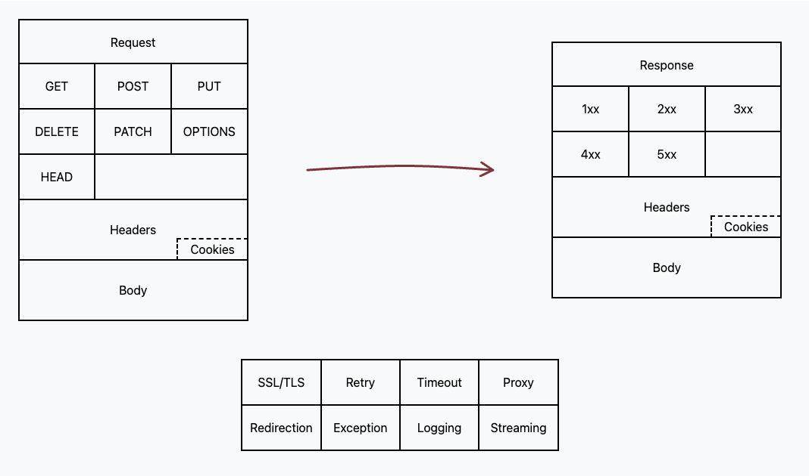

# REST Man -- simple DSL for accessing HTTP and REST resources

[](https://github.com/rest-man/rest-man/actions/workflows/ci.yml)
[](https://www.codacy.com/gh/rest-man/rest-man/dashboard?utm_source=github.com&amp;utm_medium=referral&amp;utm_content=rest-man/rest-man&amp;utm_campaign=Badge_Grade)
[](https://www.codacy.com/gh/rest-man/rest-man/dashboard?utm_source=github.com&utm_medium=referral&utm_content=rest-man/rest-man&utm_campaign=Badge_Coverage)

A simple HTTP and REST client for Ruby, inspired by the Sinatra's microframework style
of specifying actions: get, put, post, delete.

This is a fork version of [rest-client](https://github.com/rest-client/rest-client)

## Requirements

Supported Ruby versions

| 2.6 | 2.7 | 3.0 | 3.1 | 3.2 | 3.3-Preview |
| ---- | ---- | ---- | ---- | ---- | ---- |
| ✅ | ✅ | ✅ | ✅ | ✅ | ✅ |

Supported JRuby versions

| 9.3 | 9.4 |
| ---- | ---- |
| ✅ | ✅ |


## Installation

Add this line to your application's Gemfile:
```ruby
gem 'rest-man'
```

Add then execute:
```bash
$ bundle install
```

Or install it yourself as:
```bash
$ gem install rest-man
```

## Wiki

The RestMan wiki has moved to [RubyGems.Guide](https://rubygems.guide/)

[https://rubygems.guide/rest-man](https://rubygems.guide/rest-man)

[](https://rubygems.guide/rest-man)

## Contributing

Bug reports and pull requests are welcome on GitHub at https://github.com/rest-man/rest-man. This project is intended to be a safe, welcoming space for collaboration.

## License

Released under the MIT License: https://opensource.org/licenses/MIT
